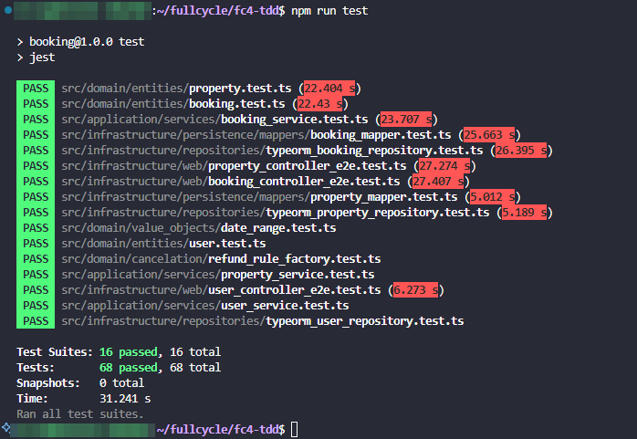

# Desafio Técnico: Desenvolvimento Orientado a Testes (TDD)

## Testes concluídos:

- 1 - Testes Unitários nos Mappers
- 2 - Testes E2E de Criação de Usuário (Guest)
- 3 - Testes E2E de Criação de Propriedade
- 4 - Testes de Políticas de Reembolso (RefundRuleFactory)
- 5 - Testes de Cancelamento de Reserva

